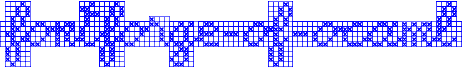

<p>
    
</p>

Copyright (C) 2017-2022, P. Baudin (https://github.com/pbaudin/fontforge-of-ocaml)

<p>
     </br>
    
</br>

# OCaml binding to FontForge #

## Library usage ##

The `fontforge-of-ocaml` library is published under the [LGPL v2.1](LICENSE.md) license and its API is documented in the file [src/FontForge.mli](src/FontForge.mli).

### Example of use ###

Look at the included test file [tests/test_FontForgeLib.ml](tests/test_FontForgeLib.ml).

### Notice ###

The binding is incomplete, but don't forget that the library is able to load `.fea` ([OpenType Feature](https://opentypecookbook.com/putting-it-together)) files to design complex fonts.

### Installation ###

The library can easily be installed from source-based package manager [Opam](https://opam.ocaml.org/)
from a [pin](https://opam.ocaml.org/doc/Manual.html#Pinning) to this GitHub repository:
```bash
$ opam pin https://github.com/pbaudin/fontforge-of-ocaml
```

On Ubuntu, the library relies on `python3-fontforge` package that contains the `python3` binding to `FontForge`:
```bash
$ sudo apt-get install -y python3-fontforge
```

## Contributing ##

Since the library meets my needs, I won't complete the binding from myself.
Nevertheless, if you want to contribute you are welcome.
Don't hesitate to open an issue for that and why not propose a pull request.

## The story ##

### Preamble ###

This library was developed in 2017 and used for the design of several [Advanced Cross-Stitch Fonts](https://github.com/pbaudin/ACSF).
Five years later, it time to publish the `fontforge-of-ocaml` library even if the binding is incomplete.

### Development ###

The first version of that library was written in [`OCaml`](https://ocaml.org/) and
used the [`Lymp`](https://github.com/dbousque/lymp) library allowing you to use `Python` functions and objects of `FontForge` API from `OCaml` world.

The `FontForge` API imposes type constraints between the arguments of the functions managing the contextual font tables.
In order to offer an `OCaml` API as close as the `FontForge` API, the use of [Generalized Algebraic Data Type](https://caml.inria.fr/pub/docs/manual-ocaml/gadts.html) of `OCaml` was seen as an opportunity.
That has not been so much used due to some bugs in the `Lymp` library raised by the hudge number of calls from `OCaml` to `Python`.
A work around has been found in generating an intermediate file (specifying the [`OpenType Feature Data`](https://opentypecookbook.com/putting-it-together/) to use in a `.fea` file) to build the final fonts from `FontForge Python` API and the `OCaml` binding. That explains why the development of the `FontForge` binding was stopped earlier that expected.

In the meantime, `Fontforge` API migrated to `Python 3` and the `Lymp` library was no more able to perform the binding with newer versions of `OCaml` compiler and various libraries.
Nevertheless, with few effort the `Lymp` library was easily replaced by the [`PyMl`](https://github.com/thierry-martinez/pyml) library.

<p>
    
</p>
